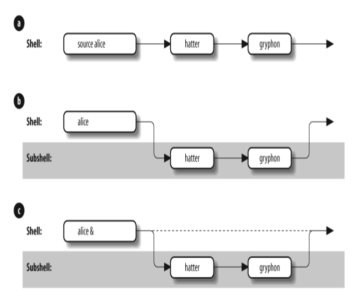
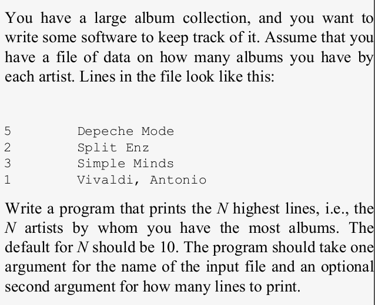
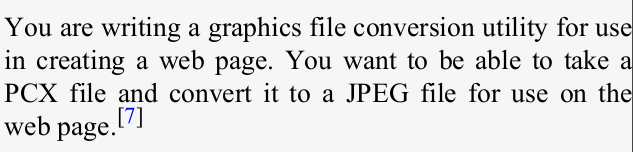
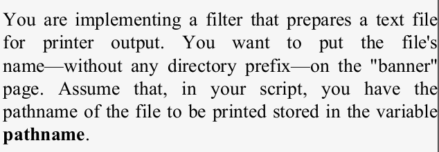
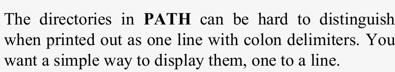
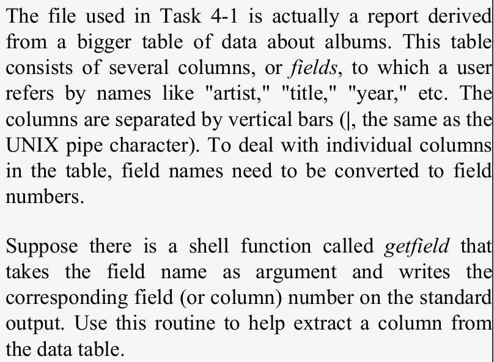
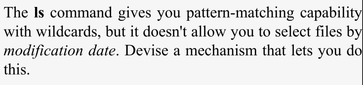
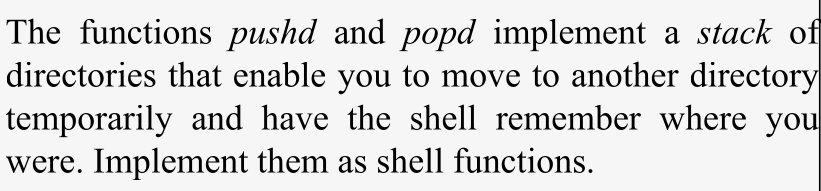

# Chapter 4 - Basic Shell Programming

🧠 Introduction

- Shell programming extends the customization techniques seen earlier.

- *bash* has some of the most advanced programming capabilities.

- You can use bash to write complete software prototypes or automate workflows.

## 📝 What Is a Shell Script?

- A shell *script* is a shell program file that contains a sequence of commands to be executed by the shell.
- Example: *`.bash_profile`* is a shell script.

- Scripts can:  
    - Set up environments

    - Run repetitive tasks

    - Perform logical operations

### 🛠️ Creating and Running Scripts

Once script is created using the text editor, there are two ways to run it.

🔹 **Method 1**: Using*` source `* or *`.`*
- Executes within the current shell
```bash
source scriptname
# or
. scriptname
```

🔹 **Method 2**: Executing Directly
- The current directory (.) or the script’s path is in your **`$PATH`**.
- The script file has execute permissions
```bash
./scriptname
```
📌 Add execute permission:
```bash
chmod +x scriptname
```
--> **Subshell vs Source**
|Execution Method | Shell Used            | Variables                    | Comments     |
| ---------------- | --------------------- | ---------------------------- | -------------------------------- |
| `source script`  | Same shell            | All vars stay                | No new process                   |
| `./script`       | Subshell              | Only exported vars available | Safe & isolated                  |
| `./script &`     | Subshell (background) | Runs asynchronously          | Parent shell remains interactive |

<br>


 How shell executes the scripts.

## 🧩 Shell Functions

📌 What is a Function?

- A function is like a "mini script" inside your shell or script.

- It is stored in memory and can be reused multiple times.

- Functions run faster than scripts and make your code modular and organized.

- Ideal for breaking large scripts into smaller, manageable parts.

### 📚 Syntax to Define Functions
**Method-1** :
```bash
function functname {
    shell commands
}
```

**Method-2** :
```bash
functname(){
    shell commands
}
```

❌ Delete a Function
```bash
unset -f functname
```


🔎 Listing Defined Functions
```bash 
 # List all functions with definitions
declare -f   

# List only function names
declare -F    
```

| Feature                   | Script (`./myscript.sh`) | Function (`myfunc`)           |
| ------------------------- | ------------------------ | ----------------------------- |
| Runs in a subshell        | ✅ Yes                    | ❌ No, runs in current shell   |
| Access to local variables | ❌                        | ✅ Yes                         |
| Scope of variables        | Limited to script        | Inherited from shell          |
| Load time                 | On execution             | Stored in memory when defined |

🎯 Order of Command Precedence

When a command is typed, bash looks in this order:

1. Aliases

2. Keywords (if, for, etc.)

3. Functions

4. Built-ins (cd, type, etc.)

5. Scripts or executables (searched via $PATH)

To order of precedence can be changed with:

- *`command`*

- *`builtin`*

- *`enable`*

### 🔍 Inspecting Commands with *`type`* 
- To know the exact source of a command

```bash
#How bash interpret the command
type commandname

# To find all definitions of commandname
type -a commandname
```

📂 Options for *`type`*

| Option | Meaning                                                 |
| ------ | ------------------------------------------------------- |
| `-a`   | Show all definitions (alias, function, file, etc.)      |
| `-p`   | Show only the path to executable/script                 |
| `-P`   | Force to find only file/script even if it’s overridden  |
| `-f`   | Ignore functions during lookup                          |
| `-t`   | Output only the type: `alias`, `function`, `file`, etc. |

## 🧠 Shell Variables in Bash

Shell variables are named memory spaces used to store data like strings or numbers. Their values can be retrieved using the dollar sign *`$`*.

There are two main types:
- Regular shell variables: used locally.
- Environment variables: shared with child processes (exported).

## 📌 Positional Parameters

These are special built-in variables used in scripts and functions to access the command-line arguments passed when a script/function is run.

| Variable      | Meaning                           |
| ------------- | --------------------------------- |
| `$0`          | Name of the script or function    |
| `$1` ... `$9` | 1st to 9th argument passed        |
| `$#`          | Number of arguments               |
| `$*`          | All arguments as a single string  |
| `$@`          | All arguments as separate strings |


🔍 $* vs $@ inside double quotes:
| Expression | Expansion                                    |
| ---------- | -------------------------------------------- |
| `"$*"`     | One single string: `"arg1 arg2 arg3"`        |
| `"$@"`     | Separate strings: `"arg1"` `"arg2"` `"arg3"` |

### 📦 Positional Parameters in Functions
- Functions also use the same positional variables (*`$0`*, *`$1`*, *`$2`*, etc.).

- To define function, can put in *`.bashrc`* or environment file.

🔁 Functions Have Local Positional Parameters
- Each function gets its own copy of *`$1`*, *`$2`*, etc.

🌍 **Variable Scope in Functions**

- By default, variables defined in functions are **global**, unless declared as local.
- For example, make a script named ascript and put this in it:
```bash
#!/bin/bash

function afunc {
    echo in function: $0 $1 $2
    var1="in function"
    echo var1: $var1
}

var1="outside function"
echo var1: $var1
echo $0: $1 $2

afunc funcarg1 funcarg2

echo var1: $var1
echo $0: $1 $2
``` 

- Then make it executable and run
```bash
chmod +x ascript
./ascript arg1 arg2
```


## 🧩 Local Variables in Functions

- By default, variables in functions are global, which can cause unintended changes in other parts of the script.

- To make a variable local (only accessible inside a function), use the *`local`* keyword.

- Previous example with **var1** made *local*
```bash
function afunc {
    local var1
    echo in function: $0 $1 $2
    var1="in function"
    echo var1: $var1
}
```


## 🧵 Quoting with *`$@`* vs *`$*`*

Both *`$@`* and *`$*`* hold all positional parameters, but they behave differently when quoted:

| Syntax | Expansion Result (Quoted)            | Behavior                                   |
| ------ | ------------------------------------ | ------------------------------------------ |
| `"$*"` | One single string (`"a b c"`)        | Merges all arguments as one                |
| `"$@"` | Separate strings (`"a"` `"b"` `"c"`) | Preserves individual arguments (preferred) |


📌 IFS (Internal Field Separator) controls the delimiter in $*. Default is space, tab, newline.

🛑 Warning: Changing IFS can break other parts of your script if not reset properly.

*`"$@"`* allow you to use them as separate values.
- Use *`"$@"`* when passing arguments between functions or scripts.

## 🧠 More on Variable Syntax

*`$varname `* vs *`${varname}`* 

*`$varname`* is a simplified form.
*`${varname}`* is the full form — safer in complex expressions.

- use {} when more than 9 positional parameters
```bash 
${10}
```

## 🧵 String Operators

🔹 What are String Operators?   

Bash string operators allow manipulation of variable values without external utilities or full programs.

They help to:
- Set default values for variables
- Catch errors if variables aren't set
- Test if a variable exists or is null
- Remove or extract parts of strings (substring operations)

🧩 Syntax 
```bash
${varname OPERATOR word}
```
| Operator               | Description                                                     | Example                            |
| ---------------------- | --------------------------------------------------------------- | ---------------------------------- |
| `${var:-word}`         | Returns `var` if set and not null, else returns `word`          | `${count:-0}` → `0` if unset       |
| `${var:=word}`         | Sets `var` to `word` if unset/null and returns it               | `${count:=0}` sets and returns `0` |
| `${var:?"message"}`    | If `var` unset/null, prints message and aborts                  | `${count:?"undefined!"}`           |
| `${var:+word}`         | If `var` is set and not null, returns `word`, else returns null | `${count:+1}` → `1` if defined     |
| `${var:offset:length}` | Substring from `offset` to `length` chars (0-based index)       | `${count:4:4}` → `foot`            |

<br>

> **TASK-1**



1. Create the file named "albums.txt" and add the lines.
    
    5 Depeche Mode  
    2 Split Enz     
    3 Simple Minds  
    1 Vivaldi, Antonio  
    4 Coldplay  
    7 Beatles   
    6 Queen     
    2 Adele     
    8 Radiohead     
    10 Taylor Swift     
    9 BTS

2. Create a file named `highest.sh` and put this script:
```bash
#!/bin/bash
sort -nr $1 | head -${2:-10}
# here the default is 10

# Removing the :- and check the output 
sort -nr $1 | head -22
```

3. Make it executable and run
```bash
chmod +x highest.sh

./highest.sh albums.txt
```
4. To run with specific number of lines
```bash
./highest.sh albums.txt 5
```

It will not show anything and wait for input without the arguments.

5. Improve the script for readability by:
- Adding comments.
- Using descriptive variable names.
- Adding error handling for missing arguments.

```bash
#!/bin/bash
# highest albums.txt [howmany]
# Print howmany highest-numbered lines in file.
# The input file is assumed to have lines that start with numbers.
# Default for howmany is 10.

filename=$1
howmany=${2:-10}
sort -nr $filename | head -$howmany
```

6. Error Handling
```bash
filename=${1:?"filename missing."}
howmany=${2:-10}
sort -nr "$filename" | head -"$howmany"
```

Other way:
```bash
filename=$1
filename=${filename:?"missing."}
```

7. Explore Additional String Operators
- *`:=`* : Sets a variable to a default value if it’s unset or null
```bash
filename=${1:?"missing."}
howmany=$2
sort -nr $filename | head -${howmany:=10}
```

- *`:+`* : Operator for a Header
```bash
header=$3
howmany=${2:-10}
echo -e -n ${header:+"ALBUMS ARTIST\n"}
sort -nr $filename | head -$howmany
```

**Substring Expansion** 

- `album_line` variable helps to assign lines of the sorted list.
- For the above example:
If print out just the album name:
```bash
# prints everything from character position 8
echo ${album_line:8}
```

If print just the number of albums:
```bash
# Supply length of substring
echo ${album_line:0:7}
```

### 🔹 Patterns and Pattern Matching

- Patterns are strings that can contain wildcard characters (*, ?, and [] for character sets and ranges).

📌 What are Pattern Operators?

Bash allows pattern-based string manipulation, especially useful in:

- Trimming file paths
- Changing file extensions
- Extracting or removing parts of strings
- Simple replacements without external tools


| Operator                       | Meaning        |
|-------------------------------|---------------------------------------------------------------------------------------------------------------------------------------------|
| `${variable#pattern}`         | Removes the shortest match of pattern from the beginning of variable.                                                                      |
| `${variable##pattern}`        | Removes the longest match of pattern from the beginning of variable.                                                                       |
| `${variable%pattern}`         | Removes the shortest match of pattern from the end of variable.                                                                            |
| `${variable%%pattern}`        | Removes the longest match of pattern from the end of variable.                                                                             |
| `${variable/pattern/string}`  | Replaces the first match of pattern with string. If string is null, deletes the match. If pattern starts with `#`, it matches the start; if it starts with `%`, it matches the end. |
| `${variable//pattern/string}` | Replaces all matches of pattern with string. Same rules for `#` and `%` apply.                                                              |

<br>

> **TASK-2**


```bash
outfile=${filename%.pcx}.jpg
```
<br>

> **TASK-3**



```bash
bannername=${pathname##*/}
```
*`{pathname##*/}`* is similar to *`basename`* but it runs in its separate process than within the shell.

- *`dirname`* : opposite to basename, returns directory prefix only
    -similar to *`${ variable %/*}`*

<br>

> **TASK-4**


```bash
echo -e ${PATH//:/'\n'}
```

### 🔹 Length Operator

This operator returns the length of the value of a variable in characters.

```bash
${#variable}
```

### 🔹 Extended Pattern Matching 

Bash allows advanced pattern matching when the *`extglob`* shell option is enabled in *`shopt`* option.

- Enable *`extglob`*
```bash
shopt -s extglob
```

📚 Table: Pattern Matching Operators

| Operator         | Meaning                                         |
| ---------------- | ----------------------------------------------- |
| `*(patternlist)` | Matches **zero or more** occurrences            |
| `+(patternlist)` | Matches **one or more** occurrences             |
| `?(patternlist)` | Matches **zero or one** occurrence              |
| `@(patternlist)` | Matches **exactly one** pattern                 |
| `!(patternlist)` | Matches **anything except** the listed patterns |


- The values can have shell wildcards as well.
- For example, +([0-9]) matches a number of one or more digits.

## 🔁 Command Substitution 

Command substitution lets you run a shell command and use its output as a variable value or part of another command.

✅ Syntax:
```bash
$ (command)
```

- For detailed information of command and location
```bash
ls -l $(type -path -all
command-name)
```


- Find only the files with matches
```bash
grep -l
```

🧠 Tip: Use double quotes when your string contains variables or command substitution.
```bash
echo "Current directory is: $(pwd)"
```
<br>

> **TASK-5**



*`cut`* extracts the columns from tubular data.

- The sample files "albums.txt" contains    
Depeche Mode|Speak and Spell|Mute Records|1981  
Depeche Mode|Some Great Reward|Mute Records|1984    
Depeche Mode|101|Mute Records|1989   
Depeche Mode|Violator|Mute Records|1990     
Depeche Mode|Songs of Faith and Devotion|Mute Records|1993

- use *`cut`* to extract the fourth (year) column:
```bash
cut -f4 -d\| albums.txt
```

-The first argument to *`getfield`* is the name of the field the user wants to extract.
```bash
fieldname=$1
cut -f$(getfield $fieldname) -d\| album
```

<br>

> **TASK-6**


- *`who`* command tells who is logged in, on which terminal and when logged in

```bash
who
```

- To get first field where space is field separator.
```bash
(who | cut -d' ' -f1)
```
- To mail them
```bash
mail $(who | cut -d' ' -f1)
```
<br>

> **TASK-7**



```bash
function lsd
{
    date=$1
    ls -l | grep -i "^.\{42\}$date" | cut -c55-
}
```
- Use this function with any command that accepts filename arguments.

## 🧩 Advanced Examples : *`pushd`* and *`popd`*

- *`pushd`* and *`popd`* manage a stack of directories, allowing you to move between directories and return to previous ones easily.

<br>

> **TASK-8**



**Stack**: A "last-in, first-out" (*LIFO*) structure, like a stack of plates. You push a directory onto the stack and pop it off to return to it.

- *`cd -`* toggles between 2 dirs only, the current and previous directory (one level).

```bash
cd -
```
- *`pushd`* *dir*: Saves the current directory, changes to *dir*, and adds *dir* to the stack.

- *`popd`* : Removes the top directory from the stack and changes to the next one.

*`pushd/popd`* supports multiple levels via a stack.

📁 Initialize Directory Stack (in *`.bash_profile`*)

- directory stack should be initialized to the null string when log in.

```bash
DIR_STACK=""
export DIR_STACK
```
📥 Function: *`pushd`*

```bash
pushd () {
    dirname=$1
    DIR_STACK="$dirname ${DIR_STACK:-$PWD' '}"
    cd ${dirname:?"missing directory name."}
    echo "$DIR_STACK"
}
```

- ${DIR_STACK:-$PWD' '} → If empty, push current dir

- ${dirname:?...} → Gives error if dirname missing

📤 Function: *`popd`*

```bash
popd () {
    DIR_STACK=${DIR_STACK#* }           # Remove top
    cd ${DIR_STACK%% *}                 # Change to new top
    echo "$PWD"
}
```

🛑 Limitations:

    ❌ No error checking for:

        Invalid directory

        Empty stack on popd

    ❌ pushd in scripts will exit shell if argument missing

    ❌ Partial pushd/popd behavior compared to bash built-ins

    ❌ Breaks if directory name has spaces
