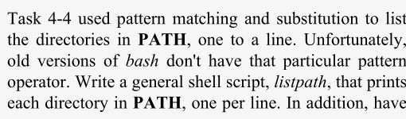

# 🌀 Chapter 5: Flow Control

✅ What is Flow Control?  
Flow control refers to mechanisms in a programming language that control the execution path of code, based on:

- Conditions (e.g., variable values, command outcomes)
- Repetitions (loops)
- User selections (menus)

Bash supports standard and unique flow control structures.

🛠️ **Flow Control Constructs in Bash**

| Construct          | Description                                            |
| ------------------ | ------------------------------------------------------ |
| `if / else / elif` | Execute commands based on conditions                   |
| `for`              | Loop for a fixed number of times (iteration over list) |
| `while`            | Loop while a condition is true                         |
| `until`            | Loop until a condition becomes true                    |
| `case`             | Multi-way branching based on value of a variable       |
| `select`           | Show a user menu to choose an option interactively     |

- _`select`_ is unique to Bash and useful for simple command-line menus.

## 🔍 if / else : Conditional Execution

Used when it is required for certain parts of your script to run only if certain conditions are met.

🔤 Syntax:

```bash
if condition
then
    statements
[elif condition
then
    statements]
[else
    statements]
fi
```

- Conditions are evaluated using **test expressions**.
- _`[ ... ]`_ is actually a command in Bash for _`test`_.

### ❓ Exit Status

When any command (a shell command, script, or function) finishes executing, it returns a special value called its **exit status** to the shell.

- _`0`_ → Success (OK)
- _`1-255`_ → Failure or Error

✅ Bash uses this status to decide whether conditions like _`if`_, _`elif`_, etc., are true or false.

#### 🧠 Key Concept:

In Bash, an _`if`_ condition doesn't directly use _`true`_ or _`false`_. Instead, it runs a command and checks that command’s exit status.

```bash
if some_command
then
    # Runs if exit status is 0 (success)
else
    # Runs if exit status is not 0 (error)
fi

# explanation
if command ran successfully
then
normal processing
else
error processing
fi
```

🧨 Problem:  
The _`pushd`_ function in last chapter:

```bash
pushd () {
    dirname=$1
    DIR_STACK="$dirname ${DIR_STACK:-$PWD' '}"
    cd ${dirname:?"missing directory name."}
    echo $DIR_STACK
}
```

- Here, if the _`cd`_ command fails (directory doesn't exist), it still adds a wrong directory to the stack.

✅ Improved Version (with _`if`_ and exit status check):

```bash
pushd () {
    dirname=$1
    if cd ${dirname:?"missing directory name."}; then
        DIR_STACK="$dirname ${DIR_STACK:-$PWD' '}"
        echo $DIR_STACK
    else
        echo "Directory change failed. Still in $PWD."
    fi
}
```

- If _`cd`_ succeeds (_`exit status 0`_), it pushes the directory.

- If it fails (_`exit status 1`_), it prints an error but don’t modify the stack.

🛠 **_Built-in vs User-defined Commands_**

Suppose a _`cd`_ function created:

```bash
cd () {
    cd "$@"
    # ❌ Will call itself endlessly
}
```

- This causes infinite recursion.

✅ **Fix**: Use _`builtin`_ to call original command

```bash
cd () {
    builtin cd "$@"
    echo "$OLDPWD --> $PWD"
}
```

- _`builtin`_ ensures the actual shell _`cd`_ is called, not the function.
- _`$@`_ passes all original arguments (like _`cd`_ folder or _`cd`_ ..).

If there is no such built-in command as passed, it will show the error message.

```bash
bash: builtin: funcname: not a shell built-in
```

**_💡 Saving and Using Exit Status_**

Exit status is stored in special variable _`$?`_

- But _`$?`_ is reset by every command! So, save it immediately if needed.
- In above function, exit status of _`cd`_ disappear as _`echo`_ runs

- To save the exit status after _`cd`_ is done, save value to variable with:

```bash
es=$?
```

### 🔁 Return

📌 What is return?

- _`return N`_ → Ends a function and returns _`N`_ as the function's exit status
- _`return`_ (without _`N`_) → Returns the status of the last command

_`return`_ can be used only inside functions or shell scripts executed with _`source`_.

- To exit a whole script, use _`exit`_.

🧪 Final _`cd`_ Function Example:

```bash
cd () {
    builtin cd "$@"        # Run built-in cd with arguments
    es=$?                  # Save exit status
    echo "$OLDPWD --> $PWD"
    return $es             # Return same status as cd
}
```

🚫 Don't Misuse Exit Status as Return Values    
❌ Exit status is not meant for passing data like numbers or strings

### 🧠 Combination of Exit Statuses

🔹 What is Exit Status Logic?   
Bash allows you to combine multiple commands based on their success or failure using:

- && (AND logic)

- || (OR logic)

- ! (NOT logic)

**_✅ && – Logical AND_**

📌 Syntax:

```bash
statement1 && statement2
```

🧾 **Meaning**:

- Run _`statement1`_

- If _`statement1`_ succeeds (i.e., _`exit status`_ is 0), then run _`statement2`_
- If _`statement1`_ fails, skips _`statement2`_

🔍 1. Check if file contains either of two keywords

```bash
filename=$1
word1=$2
word2=$3

if grep $word1 "$filename" && grep $word2 "$filename"
then
    echo "$word1 and $word2 are both in $filename."
fi
```

**_✅ || – Logical OR_**

📌 Syntax:

```bash
statement1 || statement2
```

🧾 **Meaning:**

- Run _`statement1`_

- If _`statement1`_ succeeds, skip _`statement2`_
- If _`statement1`_ fails, then run _`statement2`_

🔍 2. Check if file contains both keywords

```bash
filename=$1
word1=$2
word2=$3

if grep $word1 "$filename" || grep $word2 "$filename"
then
    echo "$word1 or $word2 is in $filename."
fi
```

**_✅ ! – Logical NOT_**

📌 Syntax:

```bash
! command
```

🧾 **Meaning:**

- Reverses the exit status

- Success becomes failure

- Failure becomes success

### 🧪 Condition Tests

- The _`if`_ construct works by checking exit statuses of commands.
- Bash provides built-in test statements to check conditions without needing external commands.

It can be tested:

- If a file exists or is readable
- If a string is empty
- If two strings are equal

And much more...

✅ Test Constructs in Bash:

1. _`[ ... ]`_ : traditional test  
   Requires spaces around brackets and conditions.

2. _`[[ ... ]]`_ — Extended test syntax (Bash-only)

- Doesn’t perform word splitting or pathname expansion.

🧠 _`[ condition ]`_ is a Command!

It returns an exit status like any other command.

- _`0`_ (true) if the condition is met
- _`1`_ (false) if it’s not

#### 🧾 String Comparisons

The square brackets (_`[]`_) surround expressions that include
various types of operators.

📏 **String Comparison Operators**

| Operator       | Meaning                                          |
| -------------- | ------------------------------------------------ |
| `str1 = str2`  | True if **strings are equal**                    |
| `str1 != str2` | True if strings are **not equal**                |
| `str1 < str2`  | True if str1 is **less than** str2               |
| `str1 > str2`  | True if str1 is **greater than** str2            |
| `-n str1`      | True if string is **not empty** (has length > 0) |
| `-z str1`      | True if string **is empty** (has length 0)       |

🛑 **_Problem:_**  
The _`popd`_ function:

```bash
popd ( )
{
    DIR_STACK=${DIR_STACK#* }
    cd ${DIR_STACK%% *}
    echo "$PWD"
}
```

- It doesn't handle an empty stack, which leads to unintended _`cd`_ to home directory, instead of an error message.

✅ Solution:

```bash
popd () {
    if [ -n "$DIR_STACK" ]; then
        DIR_STACK=${DIR_STACK#* }
        cd ${DIR_STACK%% *}
        echo "$PWD"
    else
        echo "stack empty, still in $PWD."
    fi
}
```

Put the _`$DIR_STACK`_ in double quotes for two reasons:

1. When it is expanded it is treated as
   a single word.
2. Sometimes the variable will expand to nothing, thus become _`[ -n ]`_, so by double quotes there
   will be an empty string as an argument and become _`[ -n "" ]`_.

📜 Syntax Tip: Inline _`then`_ Using Semicolon

```bash
if [ -z "$var" ]; then echo "Empty"; fi
```

📄 **Error Handling in the script _highest.sh_: Ch-4 Task-1**

- The original script

```bash
filename=${1:?"filename missing."}
howmany=${2:-10}
sort -nr $filename | head -$howmany
```

- Improved script by substituting with "_`usage`_" and make the command more in line by using dash(_`-`_) before optional argument.

```bash
if [ -z "$1" ]; then
    echo 'usage: highest filename [-N]'
else
    filename=$1
    howmany=${2:--10}
    sort -nr $filename | head $howmany
fi
```

--> More usual and better way of writing scripts (useful if too long scripts)

```bash
if [ -z "$1" ]; then
    echo 'usage: highest filename [-N]'
    exit 1
fi

filename=$1
howmany=${2:--10}
sort -nr $filename | head $howmany
```

🖼️ **Example of _`=`_ operator: Ch-4 Task-2**

- To convert other type of image formats to JPEG.
- Use NetPBM having free tools with graphic conversion utilities.

```bash
filename=$1
extension=${filename##*.}
pnmfile=${filename%.*}.pnm
outfile=${filename%.*}.jpg

if [ -z "$filename" ]; then
    echo "procfile: No file specified"
    exit 1
fi

if [ "$extension" = jpg ]; then
    exit 0
elif [ "$extension" = tga ]; then
    tgatoppm "$filename" > "$pnmfile"
elif [ "$extension" = xpm ]; then
    xpmtoppm "$filename" > "$pnmfile"
elif [ "$extension" = pcx ]; then
    pcxtoppm "$filename" > "$pnmfile"
elif [ "$extension" = tif ]; then
    tifftopnm "$filename" > "$pnmfile"
elif [ "$extension" = gif ]; then
    giftopnm "$filename" > "$pnmfile"
else
    echo "procfile: $filename is an unknown graphics file"
    exit 1
fi

pnmtojpeg "$pnmfile" > "$outfile"
rm "$pnmfile"
```

#### 📂 File Attribute Checking

🧪 What Are File Attribute Tests?

Bash provides a set of operators that test file properties like:

- File existence
- File type (regular file, directory)
- Permissions (read, write, execute)
- Ownership
- Modification time

These tests are used inside _`[ ... ]`_ (or _`[[ ... ]]`_) in _`if`_ conditions.

📊 **Common File Test Operators**

| Operator               | Description                                                     |
| ---------------------- | --------------------------------------------------------------- |
| `-a file` or `-e file` | File **exists**                                                 |
| `-d file`              | File exists and is a **directory**                              |
| `-f file`              | File exists and is a **regular file** (not dir, socket, etc.)   |
| `-r file`              | You have **read permission**                                    |
| `-w file`              | You have **write permission**                                   |
| `-x file`              | You have **execute permission**, or directory search permission |
| `-s file`              | File exists and is **not empty**                                |
| `-N file`              | File was **modified since last read**                           |
| `-O file`              | You **own** the file                                            |
| `-G file`              | File group ID matches your **group ID**                         |
| `file1 -nt file2`      | `file1` is **newer than** `file2`                               |
| `file1 -ot file2`      | `file1` is **older than** `file2`                               |

🔹 _`-nt`_ and _`-ot`_ check modification timestamps.

🔗 **Combining Conditions**  
Combine multiple [ condition ] using:

- _`&&`_ (logical AND)
- _`||`_ (logical OR)
- _`!`_ (logical NOT)

These can be put inside _`[]`_ with conditional expressions.

```bash
if [ condition ] && [ condition ]; then
```

Can also combine commands and conditional expressions

```bash
if command && [ condition ]; then
```

- Grouping: Use parentheses (escaped with \\) to group conditions
- Use two logical operators inside test conditional expressions and not shell
  - _`-a`_ - AND, similar to _`&&`_
  - _`-o`_ - OR, similar to _`||`_

🧬 Improved _`pushd`_ Function with File Tests

**🛑 Problem:**  
Previous pushd didn’t check if *`$dirname`* is a valid, accessible directory.

✅ Solution:

```bash
pushd () {
    dirname=$1
    if [ -n "$dirname" ] && [ \( -d "$dirname" \) -a \( -x "$dirname" \) ]; then
        DIR_STACK="$dirname ${DIR_STACK:-$PWD' '}"
        cd "$dirname"
        echo "$DIR_STACK"
    else
        echo "still in $PWD."
    fi
}
```

❌ Wrong way: If the the second condition is null,the function would exit prematurely.

```bash
if [ \( -n "$dirname"\) -a \( -d "$dirname" \) -a \
\( -x "$dirname" \) ]; then
```

<br>

> **TASK-1**  
> 

🛠️ **Task: Create _`fileinfo`_ Script**

✅ Script: _`fileinfo.sh`_

```bash
#!/bin/bash

if [ ! -e "$1" ]; then
    echo "file $1 does not exist."
    exit 1
fi

if [ -d "$1" ]; then
    echo -n "$1 is a directory that you may "
    if [ ! -x "$1" ]; then
        echo -n "not "
    fi
    echo "search."
elif [ -f "$1" ]; then
    echo "$1 is a regular file."
else
    echo "$1 is a special type of file."
fi

if [ -O "$1" ]; then
    echo "you own the file."
else
    echo "you do not own the file."
fi

if [ -r "$1" ]; then
    echo "you have read permission on the file."
fi

if [ -w "$1" ]; then
    echo "you have write permission on the file."
fi

if [ -x "$1" -a ! -d "$1" ]; then
    echo "you have execute permission on the file."
fi
```

Operator Precedence:

In _`[ -x "$1" -a ! -d "$1" ]`_, file tests (_`-x`_,_` -d`_) are evaluated first, then _`!`_, then _`-a`_

- Output of current directory after ls -l

```bash
ls -l dirname
```

### 🔢 Integer Conditionals

🧮 Integer vs String Comparisons

String comparison operators like _`<`_ and _`>` _ check lexicographical order, not numeric value.

✅ Integer Comparison Operators {_`[]`_}

| Operator | Meaning               | Example       |Result|
| -------- | --------------------- | ------------- | ---- |
| `-lt`    | Less than             | `[ 3 -lt 5 ]` | True |
| `-le`    | Less than or equal    | `[ 3 -le 3 ]` | True |
| `-eq`    | Equal to              | `[ 5 -eq 5 ]` | True |
| `-ge`    | Greater than or equal | `[ 6 -ge 4 ]` | True |
| `-gt`    | Greater than          | `[ 9 -gt 8 ]` | True |
| `-ne`    | Not equal             | `[ 7 -ne 9 ]` | True |

All must be used inside _`[ ]`_ with spaces around the operator and operands.

🛠️ Use integer conditionals when:

- Comparing loop counters
- Testing numeric command outputs (like line counts)
- Working with sizes, limits, or index values

⚡ Efficiency Tip

- More efficient syntax for pure numeric evaluations,

```bash
if (( a < b )); then
    echo "a is less than b"
fi
```

## 🔍 for

📌 _`for`_ Loops in Bash

- Test operations take only single arguments, so use the loop for multiple values
- _`for`_ loop allows repeating a section of code a fixed number of times, iterating over a list of values on _loop variable_.

🔹 Syntax

```bash
for name [in list]
do
  statements that can use
        $name...
done
```

- If _`in list`_ is omitted, the loop iterates over _`"$@"`_ which is the list of command-line arguments.

<br>

> TASK-2  
>   
> 

📘 Solution: Looping over PATH directories after changing the IFS that is Internal Field Separator.

```bash
IFS=:
for dir in $PATH
do
  ls -ld $dir
done
```

- If _`ls`_ error indicates that the directory on _`PATH`_ is missing, the script can be improved

```bash
IFS=:
for dir in $PATH; do
  if [ -z "$dir" ]; then dir=.; fi
  if ! [ -e "$dir" ]; then
    echo "$dir doesn't exist"
  elif ! [ -d "$dir" ]; then
    echo "$dir isn't a directory"
  else
    ls -ld $dir
  fi
done
```

📘 Looping over Command-Line Arguments using _`for`_  
To enhance the earlier _fileinfo_ script to work with multiple files:

🔸 The main script

```bash
for filename in "$@"; do
  finfo "$filename"
  echo
done
```

🔸 _`finfo`_ function (replaces fileinfo script)

```bash
finfo () {
  if [ ! -e "$1" ]; then
    echo "file $1 does not exist."
    return 1
  fi

  if [ -d "$1" ]; then
    echo -n "$1 is a directory that you may "
    if [ ! -x "$1" ]; then
      echo -n "not "
    fi
    echo "search."
  elif [ -f "$1" ]; then
    echo "$1 is a regular file."
  else
    echo "$1 is a special type of file."
  fi

  if [ -O "$1" ]; then echo "you own the file."; else echo "you do not own the file."; fi
  if [ -r "$1" ]; then echo "you have read permission."; fi
  if [ -w "$1" ]; then echo "you have write permission."; fi
  if [ -x "$1" ] && [ ! -d "$1" ]; then echo "you have execute permission."; fi
}
```

- Run the script with:

```bash
bash fileinfo.sh file1 file2 file3
```

- *`fileinfo`* will show all the files as it undergoes the script and function.

<br>

> TASK-3  
> 

🔁 **Solution**: By Recursion that refering something from itself
- Create '*tracedir*' script file.

```bash
file=$1
echo $file
if [ -d "$file" ]; then
  cd $file
  ~/tracedir $(ls)
  cd ..
fi
```

➡️ **Problem**: Creates a new shell each time. It is very insufficient so better to use functions and set up the TAB spacing.

```bash
recls () {
  singletab="\t"
  for tryfile in "$@"; do
    echo $tryfile
    if [ -d "$tryfile" ]; then
      thisfile=$tryfile
      recdir $(command ls $tryfile)
    fi
  done
  unset dir singletab tab
}
```

```bash
recdir () {
  tab=$tab$singletab
  for file in "$@"; do
    echo -e $tab$file
    thisfile=$thisfile/$file
    if [ -d "$thisfile" ]; then
      recdir $(command ls $thisfile)
    fi
    thisfile=${thisfile%/*}
  done
  tab=${tab%"$singletab"}
}
```

- The _recdir_ function causes the recursion and adds TAB.

```bash
source tracedir
recls filename
```

## 🟨 case

_`case`_ is a flow control structure used to match a string (expression) against a list of patterns that contain wildcard characters.

🔤 Basic Syntax

```bash
case expression in
  pattern1)
    statements ;;
  pattern2)
    statements ;;
  ...
esac
```

#### 🎯 Previous Example: Convert Image File Types

```bash
for filename in "$@"; do
  pnmfile=${filename%.*}.ppm
  case $filename in
    *.jpg) exit 0 ;;
    *.tga) tgatoppm "$filename" > "$pnmfile" ;;
    *.xpm) xpmtoppm "$filename" > "$pnmfile" ;;
    *.pcx) pcxtoppm "$filename" > "$pnmfile" ;;
    *.tif) tifftopnm "$filename" > "$pnmfile" ;;
    *.gif) giftopnm "$filename" > "$pnmfile" ;;
    *) echo "procfile: $filename is an unknown graphic type"; exit 1 ;;
  esac

  outfile=${pnmfile%.ppm}.new.jpg
  pnmtojpeg "$pnmfile" > "$outfile"
  rm "$pnmfile"
done
```

<br>

> TASK-4  
> 

```bash
cd() {
  case "$#" in
    0 | 1)
      builtin cd "$1"
      ;;
    2)
      newdir=${PWD//$1/$2}
      case "$newdir" in
        "$PWD")
          echo "bash: cd: bad substitution"
          return 1
          ;;
        *)
          builtin cd "$newdir"
          ;;
      esac
      ;;
    *)
      echo "bash: cd: wrong arg count" 1>&2
      return 1
      ;;
  esac
}
```

## 📌 select

🔤 Syntax of _`select`_

```bash
select name [in list]
do
  statements that can use $name
done
```

The select statement is a bash- and KornShell-exclusive feature. It’s used to:

- Create menus from a list with numbers for each choice.
- Prompt users to choose an option by number.
- Selected choice is stored in variable name and the number in the built-in variable _`REPLY`_.
- Executes the statements in the body.
- Loop until a valid choice is made or the script exits.

<br>

> TASK-5  
> 

🔧 _Setting Prompt with *`PS3`*_

- _`PS3`_ is the built-in variable that defines the prompt for _`select`_.

🧩 **Selecting a Directory from Stack**

✅ Initial Code

```bash
selectd () {
  PS3='directory? '
  select selection in $DIR_STACK; do
    if [ "$selection" ]; then
      #statements that manipulate the stack...
      break
    else
      echo "invalid selection."
    fi
  done
}
```

- The valid number by user is added to the variable _`selection`_ or else null.
- Invalid selection will lead to error and shell prints the menu again.
- _`break`_ is used to exit the _`select`_ loop when valid choice is made.

✅ Full Version of _`selectd`_ :

```bash
selectd () {
  PS3='directory? '
  dirstack=" $DIR_STACK "
  select selection in $dirstack; do
    if [ "$selection" ]; then
      DIR_STACK="$selection${dirstack%% $selection*}"
      DIR_STACK="$DIR_STACK ${dirstack##* $selection}"
      DIR_STACK=${DIR_STACK% }
      cd "$selection"
      break
    else
      echo 'invalid selection.'
    fi
  done
}
```

## 🧠 while and until

🧾 **Syntax**   

✅ *`while`* Loop
```bash
while condition
do
  statements
done
```

✅ *`until`* Loop
```bash
until condition
do
  statements
done
```

- *`while`* continues as long as the last command returns 0 (success).

- *`until`* continues as long as the last command returns non-zero (failure)

<br>

> TASK-6      


📜 Code Solution:
```bash
path=$PATH:
while [ "$path" ]; do
  ls -ld ${path%%:*}
  path=${path#*:}
done
```
<br>

> TASK-7    


📜 Code Solution:
```bash
until cp $1 $2; do
  echo 'Attempt to copy failed. waiting...'
  sleep 5
done
```

✅ Converting *`until`* to *`while`*
- Using the *`!`* (not) operator.

```bash
while ! cp $1 $2; do
  echo 'Attempt to copy failed. waiting...'
  sleep 5
done
```

- *`until`* is used rarely; mostly the *`while`* with negation can be used in cases.

