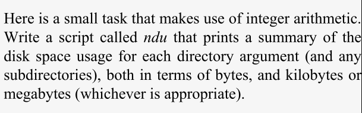

# 📘 Chapter 6 Notes: Command-Line Options and Typed Variables

🔹 **Introduction**
- Till now looked on how to process command-line arguments, write functions and shell scripts
- Not focused on handling the *options* preceded by a dash (*`-`*).
- Not learned how to do arithmetic.

## Command-Line Options

🔹 Positional Parameters like *`$1`*, *`$2`* and other variables like *`*`* or *`#`* if used with the *options*.
```bash
#syntax
command [-options] args
```
- if *options* are included, the script might be like:
```bash
if [ "$1" = "-o" ]; then
  # process -o option
  1=$2
  2=$3
fi
# normal processing of $1 and $2
```
❌ This is wrong. 

- Values to positional parameters like $1, $2 cannot be assigned as they are read-only.
- Even if it were legal, the code becomes complex and hard to scale as more options are added.
- It limits how many arguments the script can handle.


### 🔹 shift

The *`shift`* command helps by removing the first argument (*`$1`*), and shifting the rest one position left: `$2` becomes `$1`, and so on.
```bash
1 = $2
2 = $3
3 = $4
...
```
 Use `shift N` to shift N positions.
```bash
shift 3

#output
1=$4
2=$5
...
```
- Then the code can have multiple options and arguments
- Allows scripts to skip over processed options.

```bash
if [ $1 = -o ]; then
process the -o option
shift
fi
normal processing of arguments...
```
**🔹 Handling the *`-N `* Option in *`highest.sh`* script**
- The actual code for processing
```bash
filename=$1
howmany=${2:-10}
sort -nr $filename | head -$howmany
```
- he actual syntax for the script, where N=10 as default
```bash
highest filename [N]
```

- But in the UNIX syntax, the options are before the arguments
```bash
highest [-N] filename
```
- Thus, the script syntax
```bash
if [ -n "$(echo $1 | grep '^-[0-9][0-9]*$')" ]; then
    howmany=$1
    shift
elif [ -n "$(echo $1 | grep '^-')" ]; then
    echo 'usage: highest [-N] filename'
    exit 1
else
    howmany="-10"
fi

filename=$1
sort -nr $filename | head $howmany
```

🔹 To handle multiple options, we use a *`loop`* and a *`case`* block.
```bash
while [ -n "$(echo $1 | grep '-')" ]; do
  case $1 in
    -a ) #Processing option -a;;
    -b ) #Processing option -b;;
    -c ) #Processing option -c;;
    * ) echo "usage: alice [-a] [-b] [-c] args..."; exit 1;;
  esac
  shift
done
# normal processing of arguments...
```

## 🧾 Options with Arguments
Many commands have options that need arguments.
- Here, *`-d`* takes an argument *`:`* as the delimiter. 
```bash
cut -d ":" -f 2 filename.txt
```

Use *`shift`* twice: one for the option, and one for its argument.
```bash
while [ -n "$(echo $1 | grep '-')" ]; do
  case $1 in
    -a ) # Processing -a 
          ;;
    -b ) # Processing -b 
          # $2 is the option's argument
         shift ;;     
    -c ) #Processing option -c 
          ;;
    * ) echo "usage: alice [-a] [-b barg] [-c] args...";
        exit 1 ;;
  esac
  shift  # skip the option itself
done
# normal processing of arguments
```

### 📜 getopts

Manual shift works but is limited:

- Cannot handle -abc as -a -b -c
- Cannot parse -barg as -b arg
- Messy and error-prone

✅ Use *`getopts`*, a buitin command, in *`while`* loop for condition preocessing.

- *`getopts`* first argument is a string that can have letters as valid options and a colon followed by option if it requires argument. 

```bash
while getopts ":ab:c" opt; do
  case $opt in
    a ) #process option -a
      ;;
    b ) #process option -b
        #$OPTARG is the option's argument
      ;;
    c ) #process option -c
      ;;
    \? ) echo 'usage: filename [-a] [-b barg] [-c] args...' ;
      exit 1;;
  esac
done
shift $(($OPTIND - 1))
# normal processing of arguments
```
*`:ab:c`* means:
- *`a`*, *`b`*, *`c`* are valid options
- *`b:`* → *`-b`* requires an argument

*`opt`* stores each option name everytime the loop variable is executed.

First colon (*`:`*) prevents Bash from printing error messages when user gives invalid option

*`OPTARG`* stores the arguments for options 

*`OPTIND`* holds the index of the next unprocessed argument.
- Here, it will *`shift`* for the non-option arguments.

🧠 Example of 4-2.: Convert the image formats
- The improved script to change size, add border of specific color.

```bash
# Set default values
size=320
width=1
colour="-color black"
usage="Usage: $0 [-s N] [-w N] [-c COLOR] imagefile..."

# Parse options
while getopts ":s:w:c:" opt; do
  case $opt in
    s ) size=$OPTARG ;;
    w ) width=$OPTARG ;;
    c ) colour="-color $OPTARG" ;;
    \? ) echo $usage; exit 1 ;;
  esac
done

shift $(($OPTIND - 1))  # Skip parsed options

# Check if at least one image file was given
if [ -z "$@" ]; then
  echo $usage
  exit 1
fi

# Process files
for filename in "$@"; do
  ppmfile=${filename%.*}.ppm

  case $filename in
    *.gif ) giftopnm $filename > $ppmfile ;;
    *.tga ) tgatoppm $filename > $ppmfile ;;
    *.xpm ) xpmtoppm $filename > $ppmfile ;;
    *.pcx ) pcxtoppm $filename > $ppmfile ;;
    *.tif ) tifftopnm $filename > $ppmfile ;;
    *.jpg ) jpegtopnm -quiet $filename > $ppmfile ;;
    * ) echo "$0: Unknown filetype '${filename##*.}'"; exit 1 ;;
  esac

  outfile=${ppmfile%.ppm}.new.jpg

  pnmscale -quiet -xysize $size $size $ppmfile |
  pnmmargin $colour $width |
  pnmtojpeg > $outfile

  rm $ppmfile
done
```

## Typed Variables

The *`declare`* command can be used to give variable a specific type or attribute, such as: Integer, Read-only , Exported, Array.

✅ *`declare`* Command Syntax
```bash
declare [OPTION] variable=value
```

- *`-`* turns on the attribute and *`+`* turns off the attribute.

🧾 Table: Common *`declare`* Options
| Option | Meaning                                            |
| ------ | -------------------------------------------------- |
| `-a`   | Declare an **array**   |
| `-i`   | Treat variable as an **integer** (for arithmetic)  |
| `-r`   | Make variable **read-only**                        |
| `-x`   | **Export** variable to environment (like `export`) |
| `-f`   | Show all defined functions (with code)             |
| `-F`   | Show only function **names**, no body              |


**🔹 Using *`declare`* to Work with Integers (*`-i`*)**

Without *`declare`*:
```bash
val1=12
val2=5
result1=val1*val2
echo $result1     # Output: val1*val2 (no arithmetic)
```
With *`declare -i`*:
```bash
declare -i val3=12
declare -i val4=5
declare -i result2
result2=val3*val4
echo $result2     # Output: 60
```
**🔹 *`declare -r`*: Read-Only Variables**

- Makes a variable immutable (cannot be changed or unset).

*`readonly`* *name* - works same as the *`declare -r`*    
There are 3 options:  
- *`-f`* : interpret as function names argument and not variables
- *`-p`* : print list of all read-only names
- *`-a`* : interpret name arguments as arrays

```bash
# print all the reado-only names
declare -r

#same as
readonly -p
```

Variables declared inside a function with *`declare`* are **local**, similar to *`local`* keyword used to declare them.  

## 📌 Integer Variables and Arithmetic

Bash can do arithmetic using: 
```bash
$(( expression ))
```
- *`$`* is not required before the variables inside but can also used if want. 
```bash
# can use this also
a + b

# instead of
$a + $b
```

- Arithmetic operations are evaluated inside double quotes. 

> Note:   
> - Use double quotes if the string involves tilde, variables, or anything with *`$`* like command substitution.
> - Otherwise use single quotes.

Example:
- *`date`* command accepts arguments for the output format.
```bash
echo $(date)
```
- *`+%j`* prints the day of the year.
```bash  
echo $(date +%j)
```
**🔹 Bash Arithmetic Operator Table**
| Operator| Meaning|                      
 -----------------------|------------------------- | 
`++` / `--`             | Increment / Decrement (prefix or postfix)|          
`+` / `-` / `*` / `/`   | Addition, Subtraction, Multiplication, Division |
`%`                     | Remainder (Modulo)
`**`                    | Exponentiation |
`<<` / `>>`             | Bitwise left/right shift | 
`&` / `\|` / `^`                | Bitwise AND, OR, XOR |       
`~`, `!`                | Bitwise NOT, Logical NOT |
`,`                     | Sequential evaluation 

The increment and decrememt is done by a value of one
```bash
# post-increment
value++
# pre-increment
++value
```
Use parentheses for grouping subexpressions.
- Arithmetic expression supports relational operators as truth values;  
where `1`=true and `0`=false.

-For relational expressions, logical and relational operators can be combined. They are:


| Operator       | Meaning                              |
| -------------  | ------------------------------------ |
| `<` / `>`      | Less than                            | 
| `<=`/ `>=`     | Less than / Greater than or equal to |
| `==`/`!=`      | Equal to / Not equal to              |
| `&&` / `\|\|`  | Logical AND / OR                     |


```bash
#value is 1
echo $((3 > 2))

# value is 1 as true conditions
echo $(( (3 > 2) || (4 <= 1) ))

# value is 0 
echo $(( (3 > 2) && (4 <= 1) ))
```
Bash supports `base-N numbers` in arithmetic expressions with syntax *`B # N`*
- B is the base between 2 to 36. Default is 10.
- N is the number in that base.

### 🧠 Arithmetic Conditionals
- Strings can bec compared by notation [...] or the **test** with their operators.

**🧾 Table for Test relational operators**

| Operator | Meaning                 |
| -------- | ----------------------- |
| `-lt`    | Less than               | 
| `-le`    | Less than or equal to   |
| `-gt`    | Greater than            |
| `-ge`    | Greater than or equal to|
| `-eq`    | Equal to                |
| `-ne`    | Not equal to            |

- It returns the result (exit status) of *`0`* as false and *`1`* as true.

- Using `[ ... ]`
```bash
a=6
b=3
if [ "$a" -gt "$b" ]; then
  echo "$a is greater than $b"
fi
```
- These can be combined using the (\\) before parentheses to escape them.
```bash
echo $["\(3 -gt 2 \) || \( 4 -le 1 \)"]
```
- Using parentheses `$((...))`
```bash
[ echo $(((3 > 2) && (4 <= 1))) = 1 ]
```

- More clear way using `((...))`
```bash
echo (( (3 > 2) && (4 <= 1) ))

#the previous example can be 
if (( a > b )); then
  echo "a is greater than b"
fi
```

### Arithmetic Variables and Assignment

- The integer variables can be assigned using *`declare`*.
- The arithmetic expressions can be evaluated and assigned to variables using *`let`*.

✅ Syntax:
```bash
let intvar=expression
```
- No need for `$((...))` in expression as let treats the right side as arithmetic expression.
- Quote the expression if it contains special characters like `*`, `#`, or whitespace.

📜 Some Sample Integer Expression Assignments

| Statement           | Value  | 
| ------------------- | ------ | 
| `let x= `           | `$x`   |        
| `1+4`               | 5      |        
|  `"2 + 3 * 5"`      | 17     |         
|  `'(2 + 3) * 5'`    | 25     |       
| `'17 % 3'`          | 2      |        
| `"1<<4"`            | 16     |        
| `"48>>3"`           | 6      |        
| `'17 & 3'`          | 1      |        
| `'17 \| 3'`         | 19     |   

<br>

> TASK-1    


- Create file *ndu* and add the script
```bash
for dir in ${*:-.}; do
    if [ -e $dir ]; then
        result=$(du -s $dir | cut -f 1)
        let total=$result*1024
        echo -n "Total for $dir=$total bytes"
    
        if [ $total -ge 1048576 ]; then
            echo "($((total/1048576)) Mb)"
        elif [ $total -ge 1024 ]; then
            echo "($((total/1024)) Kb)"
        fi
    fi
done
```
- *`du`* is a UNIX utility for disk usage of files and directories.
```bash
#default output is current directory list with the space used in terms of block.
du
```
- The last line gives total usage.
- *`-s`* can be used to get the last line.

🔹 **`pushd/popd`**

The improved version that can take the *nth* directory in the stack.

- *`pushd`* function  
```bash
pushd ( )
{
  dirname=$1
  if [ -n $dirname ] && [ \( -d $dirname \)\( -x $dirname \) ]; then
    DIR_STACK="$dirname ${DIR_STACK:-$PWD' '}"
    cd $dirname
    echo "$DIR_STACK"
  else
    echo "still in $PWD."
fi
}
```

- *`popd`* function
```bash
popd ( )
{
  if [ -n "$DIR_STACK" ]; then
    DIR_STACK=${DIR_STACK#* }
    cd ${DIR_STACK%% *}
    echo "$PWD"
  else
    echo "stack empty, still in $PWD."
  fi
}
```

- To get nth directory, while loop can be used for top directory transfer to the temporary copy of stack *n* times.

```bash
getNdirs ( )
{
  stackfront=''
  let count=0
  while [ $count -le $1 ]; do
    target=${DIR_STACK%${DIR_STACK#* }}
    stackfront="$stackfront$target"
    DIR_STACK=${DIR_STACK#$target}
    let count=count+1
  done
  stackfront=${stackfront%$target}
}
```

📂 *`pushd`* function:
```bash
pushd () {
  if [ $(echo $1 | grep '^+[0-9][0-9]*$') ]; then
    let num=${1#+}
    getNdirs $num
    DIR_STACK="$target$stackfront$DIR_STACK"
    cd $target
    echo "$DIR_STACK"

  elif [ -z "$1" ]; then
    firstdir=${DIR_STACK%% *}
    DIR_STACK=${DIR_STACK#* }
    seconddir=${DIR_STACK%% *}
    DIR_STACK=${DIR_STACK#* }
    DIR_STACK="$seconddir $firstdir $DIR_STACK"
    cd $seconddir

  else
    dirname=$1
    if [ \( -d $dirname \) -a \( -x $dirname \) ]; then
      DIR_STACK="$dirname ${DIR_STACK:-$PWD' '}"
      cd $dirname
      echo "$DIR_STACK"
    else
      echo "still in $PWD."
    fi
  fi
}
```
📂 *`popd`* function:
```bash
popd () {
  if [ $(echo $1 | grep '^+[0-9][0-9]*$') ]; then
    let num=${1#+}
    getNdirs $num
    DIR_STACK="$stackfront$DIR_STACK"
    cd ${DIR_STACK%% *}
    echo "$PWD"

  else
    if [ -n "$DIR_STACK" ]; then
      DIR_STACK=${DIR_STACK#* }
      cd ${DIR_STACK%% *}
      echo "$PWD"
    else
      echo "stack empty, still in $PWD."
    fi
  fi
}
```
--> There is *`dirs`* command which lists the current directories in the stack.
- There are options like *`-n`* to print out the nth directory  and *`-l`* to provide long list.
```bash
dirs

dirs -n

dirs -l
```

### 🔁  Arithmetic *`for`* Loops
- These are like the Java or C language *`for`* loops.

✅ Syntax:
```bash
for (( initialisation; ending condition; update ))
do
  # commands/statements...
done
```
<br>

> TASK-2    

- Use nested *`for`* loop.
```bash
for (( i=1; i<=12; i++ ))
do
  for (( j=1; j<=12; j++ ))
  do
    echo -ne "$((i * j))\t"
  done
  echo
done
```

## 🔍 Arrays

An array is a collection of indexed elements (strings or numbers) accessed using numerical indices starting from 0.

✅ Syntax to refer array
```bash
${array[i]}
```
**🔸 Creating Arrays**

- Indexed Assignment:
```bash
greet[0]="hello"
greet[1]="hi"
greet[2]="welcome"
```

-  Compound Assignment:
No need to assign in order
```bash
greet=([2]="welcome" [0]="hello" [1]="hi")
```

- Auto-indexing: If in order
```bash
greet=("hello" "hi" "welcome")   # indices: 0, 1, 2
```

- Mixed Indexing: Index at some point in array and then assigning values after it.
```bash
greet=("hello" [5]="hi" "welcome")
# greet[0]="hello", greet[5]="hi", greet[6]="welcome"
```

- Create empty array add read-only arrays
```bash
declare -a names

#read-only
declare -ar names
```

- Use special indices like `*` and `@`.
```bash
echo ${greet[*]}     # All elements (single word)
echo "${greet[@]}"   # All elements (as separate words)
```
🔁 Looping Through an Array
```bash
for item in "${greet[@]}"; do
  echo "$item"
done
```
To know what values are in indices in array
```bash
${!array[@]}
```

To know lenth of element or find values in array
```bash
${#array[i]}

greet=(hello [3]=hi welcome)

#find values in array with special indices
${#greet[@]}
```

Reassigning the existing array will remove the old one
```bash
greet=([100]="good morning")
# this will remmove the previous one  
```

Use *`unset`* to remove any element or the array.
```bash
#to remove specific index number
unset greet[100]

# to unset whole array
unset greet
```

🔧 Example: User ID Lookup from `/etc/passwd`
```bash
for i in $(cut -f1,3 -d: /etc/passwd); do
  array[${i#*:}]=${i%:*}
done

echo "User ID $1 is ${array[$1]}"
echo "There are ${#array[@]} user accounts."
```

<br>

> TASK-3    


```bash
values=(39 5 36 12 9 3 2 30 4 18 22 1 28 25)
numvalues=${#values[@]}

for (( i=0; i<numvalues; i++ )); do
  lowest=$i
  for (( j=i; j<numvalues; j++ )); do
    if [ ${values[j]} -le ${values[lowest]} ]; then
      lowest=$j
    fi
  done
  temp=${values[i]}
  values[i]=${values[lowest]}
  values[lowest]=$temp
done

for (( i=0; i<numvalues; i++ )); do
  echo -ne "${values[$i]}\t"
done
echo
```
**Bubble Sort**
- Works by iterating over the list comparing pairs of elements and swapping them if they are in incorrect order.
- Repeats the process from the start of the list and continues until the list is traversed with no swaps.

