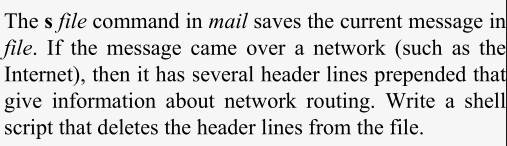

# 📘 Chapter 7: Input/Output and Command-Line Processing 

## 🗂️ Overview

Previously covered flow of data and control. This chapter will cover:
1. **File-oriented I/O**: Using shell redirectors to handle input and output.

2. **Line and word-level I/O**: Moving data between files/terminals and shell variables.

3. **Command-line processing**: How the shell reads and interprets command lines.

## 🔁 I/O Redirectors

🔸 *`cmd1 | cmd2`* : **Pipe**     
Take standard output of *`cmd1`* and passes it as standard input to *`cmd 2`*.


🔸 *`> / < file`* : **Redirect standard output /input to a file**  
Creates or overwrites (if existing) the file.

🔸 *`>> file / n>> file`* : **Append standard output / file descriptor `n` to a file**      
Creates file or adds the output at the end of file existing without overwriting it.

🔸 *`>| file / n>| file`* : **Force overwrite even if *`noclobber`* is on**        
Normally, `>` would be blocked, but `>|` forces it / for the descriptor `n`.

🔸 *`<> file / n<> file`* : **Use file for both input and output**  
Opens file for both reading and writing using /file descriptor `n`. Used moslty with device files.

🔸 *`<< label`* : **Here-Document**     
For multiple input line.

🔸 *`n> file /  n< file`* : **Redirect file descriptor `n` to /from  file**     
Open file descriptor `n` to write to or read from the file.

🔸 *`n>& /  n<&`* : **Duplicate stdout to / stdin from file descriptor `n`**        
Not complete unless followed by a number or redirection.

🔸 *`n>&m /  n<&m`* : **Make `n` a copy of output /input file descriptor `m`**     

🔸 *`&>file`* : **Redirect both stdout and stderr to a file**       
Useful for debugging: captures both outputs in a file.

🔸 *`<&- / >&-`* : **Close standard input/ output**  

🔸 *`n>&- / n<&-`* : **Close input/ output from file descriptor `n`**       

🔸 *`n>&word / n<&word`* :    
- If `n` not specified stdout / stdin is used.  
- If `word` is digits, but not file descriptor open for output / input, redirection error occurs.     
- If `word` does not expand to digits stdout and stderr redirected.
- If `word` expand to digits, `n` is made to be copy of that file descriptor digit. 
- If `word` = `-`, closes descriptor.

🔸 *`n>&digit- / n<&digit-`* : **Moves `digit` to descriptor `n` or stdout / stdin**        
`digit` closes after being duplicated to `n`.

## 📌 Here-Documents
A **here-document** is a way to redirect multiple lines of input into a command within a script or at the command line.

✅  Syntax:
```bash
command << label
line1
line2
...
label
```
- Everything between `<< label` and the ,matching `label` line is fed as standard input called *here-document*.

- Meant to be used from within shell scripts.
- Can be used to stimulate *mail* facility.

```bash
cat >> msgfile << .  #label start
this is the text of #line 1
our message.  #line 2
.  #label end
```
<br>

> TASK-1        


- We can use *ed.*
- In mail syntax, there is blank line between header and message.

🎯 Goal: Write a script to delete all lines up to the first blank line.

```bash
ed $1 << EOF
1,/^[ ]*$/d
w
q
EOF
```
-> Variable & Command Substitution inside here-documents is done by the shell.

- Example: Stripped-down version of `bashbug`
```bash
MACHINE="i586"
OS="linux-gnu"
CC="gcc"
RELEASE="2.01"
PATCHLEVEL="0"
RELSTATUS="release"
MACHTYPE="i586-pc-linux-gnu"
TEMP=/tmp/bbug.$$
```
- Shell variables are set.
- `$$` gives current process ID, used to create a unique temp file name.

```bash
cat > $TEMP <<EOF
From: ${USER}
To: ${BUGADDR}
Subject: ...
Machine: $MACHINE
...
EOF
```
- Output of this `cat` command (with expanded variables) is saved in `$TEMP`.

- To disable variable/command substitution, use quotes around the label:
```bash
cat << 'EOF'
$USER
$(date)
EOF
```

Indented Here-Documents with `<<-`
- Allows leading TABs only (not spaces) to be stripped automatically.
```bash
cat <<-EOF
	This line starts with a TAB.
EOF
```

🧵 **Here-String**
- A quick way to redirect a single line of input to a command.
```bash
command <<< word
```

## 📌 File Descriptor
A file descriptor (FD) is an integer that refers to an open file or data stream in a running process.

- In UNIX/Linux systems, every process begins with 3 standard file descriptors:

| FD | Name     | Description           |
| -- | -------- | --------------------- |
| 0  | `stdin`  | Standard input        |
| 1  | `stdout` | Standard output       |
| 2  | `stderr` | Standard error output |

- To save standard error in a file
```bash
2> file
```
- To save stdout
```bash
> file
1> file
```

<br>

> TASK-2        


- Create *start* as shell script file
```bash
"$@" > logfile 2>&1 &
```

- To send both in pipe instead of file
```bash
"$@" 2>&1 | tee logfile &
```
- `tee` command takes input and copies to stdout and the file given as arg.

These scripts require you to stay logged in until the background job completes.

## 🧠 String I/O

### 📦 echo

It prints its arguments to standard output (stdout).

⚙️ Options to *`echo`*:

| Option | Function                                                  |
| ------ | --------------------------------------------------------- |
| `-e`   | Enables **interpretation of backslash escape characters** |
| `-E`   | Disables escape charcter interpretation (default in some systems)  |
| `-n`   | **Suppresses the trailing newline** character             |

#### 🔡 echo escape sequences

When using `-e`, you can include escape sequences to control formatting.

| Sequence     | Description                                                        |
| ------------ | ------------------------------------------------------------------ |
| `\a`         | Bell sound (**alert**); same as CTRL-G                             |
| `\b`         | Backspace (CTRL-H)                                                 |
| `\c`         | Suppress output **after this point**, including newline            |
| `\e` or `\E` | **Escape character** (used in ANSI sequences)                      |
| `\f`         | Formfeed (CTRL-L); clears screen or moves page (printer dependent) |
| `\n`         | Newline (CTRL-J) — useful in **multi-line output**                 |
| `\r`         | Carriage return (CTRL-M) — returns to line start                   |
| `\t`         | Horizontal tab (CTRL-I)                                            |
| `\v`         | Vertical tab (CTRL-K) — now mostly obsolete                        |
| `\\`         | A single backslash (`\`)                        |                 
| *`\ 	n`*         | ASCII character with octal (base-8) value n (1 to 3 digits) |
| `\0nnn`      | Character with **octal value** `nnn` (1 to 3 digits)               |
| `\xHH`       | Character with **hexadecimal value** `HH` (1 or 2 digits)          |


The `\n`, `\0`, and `\x` sequences: more system dependent.

### 🔍 printf
- More powerful and flexible printing approach.
- It does not give newline after printing. Use `\n` to add one.
```bash
printf "Hello World \n"
```

🧱 Basic Syntax 
```bash
printf format-string [arguments]
```
- `format-string` → defines how to display the output 

- `[arguments]` → the argument list to print like strings or variable values.

Each placeholder in the `format-string` starts with `%` and defines how to print the value.
- The two main specifiers are `%s` for strings and `%d` for the decimal integers.

```bash
printf "%s %s\n" hello world
```
Can also be like
```bash
printf "hello %s\n" world
```
📋 Table: Common printf Format Specifiers
| Specifier  | Description                                                      |
| ---------- | ---------------------------------------------------------------- |
| `%s`       | String                                                           |
| `%d`, `%i` | Decimal integer                                                  |
| `%c`       | Single ASCII character (prints 1st character)    |
| `%f`       | Floating-point number (standard format)                          |
| `%e`, `%E` | Floating-point (scientific notation, lowercase or uppercase `E`) |
| `%g`, `%G` | Auto choose between `%e` / `%E` or `%f`, whichever is shorter with trailing 0s removed       |
| `%o`       | Unsigned octal value        |
| `%u`       | Unsigned decimal value       |
| `%x`, `%X` | Unsigned hexadecimal number (lowercase or uppercase)  use `a-f` / `A-F` for `10-15`|
| `%%`       | Prints a literal percent sign                                    |

- The width of the output and alignment of output field can be controlled.

📋 Format:
```bash
%flags width.precision format-specifier
```
📌 Field Width	
- Default is right-justified
- Use `-` flag to left-justify

```bash
#right-justified
printf "|%10s|\n" hello

#left-justified
pritnf "|%-10s|\n" hello
```

📌 Precision modifier
- For **integers/float**: controls number of digits visible in result
- For **strings**: controls maximum number of characters printed

🧮 Table: Precision Behavior by Specifier
| Conversion                         | Precision Meaning                                  |
| ---------------------------------- | -------------------------------------------------- |
| `%d`, `%i`, `%o`, `%u`, `%x`, `%X` | Minimum number of digits (pads with leading zeros) |
| `%e`, `%E`                         | Digits after decimal point (default 10)            |
| `%f`                               | Decimal places shown                               |
| `%g`, `%G`                         | Max number of significant digits                   |
| `%s`                               | Max number of characters printed                   |

🚩 Flags for *`printf`*
| Flag    | Description                                                                                                                |
| ------- | -------------------------------------------------------------------------------------------------------------------------- |
| `-`     | Left-justify (default is right-justify)                                                                                    |
| `+`     | Always show numeric sign (e.g., `+5`)                                                                                      |
| `space` | Space for positive numbers, minus for negative                                                                             |
| `0`     | Pad with zeros instead of spaces                                                                                           |
| `#`     | Use **alternate format**:<br> `%o` → adds leading 0<br> `%x`, `%X` → adds `0x` or `0X`<br> Floats always get decimal point |

If `printf` fails, it returns a non-zero exit status.

🔧 **Bash-Specific `printf` Specifiers**
- Can be used instead of `%s`

1. *`%b`* → Interprets escape sequences 

```bash
#with %s
printf "%s\n" "Hello\nWorld"

#with %b
printf "%b\n" "Hello\nWorld"
```

2. *`%q`* → Escape string for shell-safe output
```bash
printf "%q\n" "hello world"
```

### 🟢 read

The `read` command reads a line of input from standard input and stores words into variables.

🧱 Basic Syntax:
```bash
read var1 var2 var3 ...
```
- Input is split into words using characters from the **IFS** variable (defaults to: space, TAB, newline).

- Words are assigned one per variable from left to right.

- If there are more words than variables, the last variable gets all the remaining words.

- If no variables are given, the entire input is stored in the default variable: `REPLY`.	

```bash
read character1 character2
hello world

echo $character1
echo $charcter2
```

- `read` is more like:
```bash
while read line; do
  #process the line
  #print the processed line
end
```
This approach:
- Resembles C-style scripting.
- Is slower than pipelines.
- But gives finer control when needed.

📦 When is `read` Useful?

- When input is short or small (a few hundred lines).
- When you need to assign parts of lines to variables.

- When reading user input.

- When doing interactive scripts.

📖 Problem:
Set the correct TERM value for the user's terminal device based on a configuration file.

- If the config file `/etc/terms` looks like this:
```bash
console     console
tty01       wy60
tty03       vt100
tty04       vt100
tty07       wy85
tty08       vt100
```


- First field = terminal line (e.g., tty03)
-  Second field = terminal type (e.g., vt100)

Solution:
Setting TERM based on `tty`
```bash
TERM=vt100  # default
line=$(tty) # get current terminal device path, like /dev/tty03
while read dev termtype; do
  if [ $dev = $line ]; then
    TERM=$termtype
    echo "TERM set to $TERM."
    break
  fi
done
```
❗ Problem with above script:
- It reads from standard input, not from the file `/etc/terms`.
- Here, need to redirect input from the file.

#### 🔄 I/O Redirection and Multiple Commands

The probelem can be solved by reading from a file instead of the keyboard (stdin), for which Bash gives you four main ways:

1. By Function
```bash
findterm() {
  TERM=vt100
  line=$(tty)
  while read dev termtype; do
    if [ "$dev" = "$line" ]; then
      TERM=$termtype
      echo "TERM set to $TERM."
      break
    fi
  done
}

findterm < /etc/terms
```

2. Redirect Inside Function Body using `<`
```bash
findterm() {
  TERM=vt100
  line=$(tty)
  while read dev termtype; do
    if [ "$dev" = "$line" ]; then
      TERM=$termtype
      echo "TERM set to $TERM."
      break
    fi
  done
} < /etc/terms
```

3. I/O Redirect at End of Loop
```bash
TERM=vt100
line=$(tty)
while read dev termtype; do
  if [ "$dev" = "$line" ]; then
    TERM=$termtype
    echo "TERM set to $TERM."
    break
  fi
done < /etc/terms
```
- Works for any compound statement:
`while`, `if`, `case`, `select`, etc.

#### 🎛️ Command Blocks
- It is like a nameless function and another type of compound statement.    
- Redirection applies to the whole block.
- Code is between curly brackets `{` and `}`.

```bash
{
  TERM=vt100
  line=$(tty)
  while read dev termtype; do
    if [ "$dev" = "$line" ]; then
      TERM=$termtype
      echo "TERM set to $TERM."
      break
    fi
  done
} < /etc/terms
```
- Can make `/etc/terms` like system configuration files by adding comments.
- Suppose the config file looks like this:
```bash
# System console
console     console
# Wyse terminals
tty01       wy60
```

To skip comment lines, add this condition to while loop:  
```bash
if [ -z "$(echo "$dev" | grep '^#')" ] && [ "$dev" = "$line" ]; then
```
🧮 Example:
- `dc` command: is command-line calculator that stimulates the Reverse Polish Notation (RPN).
- To convert algebraic notation to RPN for `dc` command.
```bash
{ 
  while read line; do
    echo "$(alg2rpn "$line")"
  done 
} | dc
```

#### ✍️ Reading User Input
- Use `read` to prompt a user for input.
```bash
echo -n "terminal? " 
read TERM
echo "TERM is $TERM"
```

<br>


- The previous solution with `select`:
```bash
selectd () {
  PS3='directory? '
  select selection in $DIR_STACK; do
    if [ "$selection" ]; then
      #statements that manipulate the stack...
      break
    else
      echo "invalid selection."
    fi
  done
}
```
- If `select` is not used:
```bash
echo "Select a directory:"
done=false
while [ "$done" = false ]; do
  done=true
  num=1
  for direc in $DIR_STACK; do
    echo "$num) $direc"
    num=$((num+1))
  done
  echo -n "directory? "
  read REPLY
  if [ "$REPLY" -lt "$num" ] && [ "$REPLY" -gt 0 ]; then
    set - $DIR_STACK
    # statements that manipulate the stack...
    break
  else
    echo "invalid selection."
  fi
done
```

📚 List of `read` Command Options

| Option         | Description                                      |
| -------------- | ------------------------------------------------ |
| `-a array`     | Stores words into array starting at index 0      |
| `-d delimiter` | Use this character as the **end of input**       |
| `-e`           | Use **readline** features (arrow keys, history)  |
| `-n N`         | Read only **N characters**, then return          |
| `-p prompt`    | Show prompt **before reading**                   |
| `-r`           | Do **not** interpret backslashes (`\`) as escape |
| `-s`           | **Silent mode** (no echo) — useful for passwords |
| `-t N`         | Wait **N seconds** before timeout                |


## 🚦Command-Line Processing

- Each line that the shell reads from
the standard input or a script is called a pipeline containing commands with `0` or `|`. 
- Each pipeline is read and broken to each of the commands.

- Whenever Bash reads a command (from the terminal or a script), it performs a 12-step processing cycle on each pipeline:


🔁 The Full 12-Step Process

| Step   | Description                                                                                                                    |          |
| ------ | ------------------------------------------------------------------------------------------------------------------------------ | -------- |
| 1️⃣    | **Tokenization**: Breaks the command into tokens using metacharacters: SPACE, TAB, NEWLINE, `;`, `(`, `)`, `<`, `>`, \`        | `, `&\`. |
| 2️⃣    | **Keyword Check**: If the first word is a shell **keyword** (like `if`, `do`, `{`), it starts building a **compound command** or else signals error. |          |
| 3️⃣    | **Alias Substitution**: If the first word is an alias, it’s replaced and processing restarts from Step 1. Also allow to define keywords' alias.                     |          |
| 4️⃣    | **Brace Expansion**: `{a,b}` becomes `a` and `b` (e.g., `file{1,2}` becomes `file1 file2`).                                    |          |
| 5️⃣    | **Tilde Expansion**: `~user` becomes `/home/user`.                                                                           |          |
| 6️⃣    | **Variable Substitution**: Replaces `$var` with its value.                                                                     |          |
| 7️⃣    | **Command Substitution**: `$(command)` is executed, and its output replaces the expression.                                    |          |
| 8️⃣    | **Arithmetic Expansion**: `$(())` evaluates expressions, e.g., `$((2537 % 1000))` gives `537`.                                 |          |
| 9️⃣    | **Word Splitting**: Resulting words are split using characters in `$IFS` (default: space, tab, newline).                       |          |
| 🔟     | **Pathname (Wildcard) Expansion**: Expands `*`, `?`, and `[]` to matching files.                                               |          |
| 1️⃣1️⃣ | **Command Lookup**: Searches for command in this order: **function → built-in → file in \$PATH**.                              |          |
| 1️⃣2️⃣ | **Execution**: The command is executed with I/O redirection and arguments.                                                     |          |

> Command-Line Processing Steps 


✅ Example of Command Processing:

-Suppose give,
```bash
alias ll="ls -l"

ll $(type -path cc) ~alice/.*$(($$%1000))
```
Assume:
- `$$` = 2537
- `~alice` = /home/alice
- `.hist537` exists

Step-by-step:
| Step | Transformation                                           |
| ---- | -------------------------------------------------------- |
| 1    | `ll $(type -path cc) ~alice/.*$(($$%1000))` is tokenized |
| 2    | `ll` is not a keyword                                    |
| 3    | `ll` alias → becomes `ls -l`                             |
| 4    | Nothing to expand in braces                              |
| 5    | `~alice` → `/home/alice`                                 |
| 6    | `$$` → `2537`                                            |
| 7    | `$(type -path cc)` → `/usr/bin/cc`                       |
| 8    | `$(($$%1000))` → `537`                                   |
| 9    | Word splitting done                                      |
| 10   | `/home/alice/.*537` → `/home/alice/.hist537`             |
| 11   | Finds `ls` in `/usr/bin`                                 |
| 12   | Runs `/usr/bin/ls -l /usr/bin/cc /home/alice/.hist537`   |


### 🧵 Quoting

✅ Single Quotes '...'
- Prevents all steps till step-10.
- Everything inside is taken literally.
- No variables, no substitutions, no escaping inside.
- Cannot use single quotes inside single quoted string.

✅ Double Quotes "..."
- By pass steps 1-4 and 9-10.
- Variable substitution, Command substitution and Arithmetic substitution.
- Prevents Pipe, alias, Word splitting, Wildcard expansion and Tilde expansion.
- Can use double quotes inside the double quoted string escaping it with backslash.
- Also escape \$ , \` , \\ .

### 🔀 command, builtin, and enable

- Command lookup default order:
1. Function
2. Built-in
3. Command in $PATH

- Override this order using:
1. command
2. builtin
3. enable

✅ **command**
-
- Skips aliases and functions.
- Only checks built-ins and command in PATH.
- Use it to call real commands inside functions of the same name.

```bash
  cd () {
  # some fancy things
  command cd   # Avoids calling itself recursively
}
```
*Options for command:*

| Option | Description                            |
| ------ | -------------------------------------- |
| `-p`   | Use system default PATH                |
| `-v`   | Print command or pathname              |
| `-V`   | Verbose output than -v                 |
| `-`   | Stop further option checking           |

✅  **builtin**
-
- Skips functions and external files.
- Similar to `command` but this ignores the commands in PATH.
- Only runs built-in shell commands.

```bash
cd () {
  echo "Replace command with builtin"
  builtin cd 
}
```

✅ **enable**
-
- enables or disables built-ins.
- Useful when you create a script with the same name as a built-in.
- It allows to run script without full pathname.

*Options for enable:*
| Option | Description                          |
| ------ | ------------------------------------ |
| `-a`   | Show all built-ins and their status  |
| `-n`   | Disable one or more built-ins or display list of disabled built-ins     |
| `-p`   | Show all enabled built-ins           |
| `-s`   | Restrict output to POSIX built-ins   |
| `-f`   | Load new built-in from shared object |
| `-d`   | Delete a built-in loaded with `-f`   |

POSIX Special built-ins: `:`, `.`, `source`, `break`, `continue`, `eval`, `exec`, `exit`, `export`, `readonly`, `return`, `set`, `shift`, `trap`, and `unset`.

### 💡 eval
- Evaluates its arguments twice: once to expand variables, and then again as a new command line.

- Allows dynamically building commands in scripts.

```bash
listpage="ls | more"
$listpage   # WRONG: the pipe (|) is not interpreted correctly
eval $listpage   # CORRECT: shell reinterprets the command line
```
🧩 Example: Task 4-1
The file named albums.txt and script sorts the file to print first N lines.
```bash
# The resulting pipeline
sort -nr $1 | head -${2:-10}
```
- If default is to print whole file instead of 10 lines.
```bash
if [ -n "$2" ]; then
    sort -nr $1 | head -$2
else
    sort -nr $1
fi
```
- More compact solution:
```bash
eval sort -nr \$1 ${2:+"| head -\$2"}
```
- Thus, if `$2` is not null, it is:
```bash
eval sort -nr \$1 | head -\$2
``` 
- Or if $2 is null
```bash
eval sort -nr \$1
```

📥 **Continued to Task-2**
- Previous solution could not contain output redirectors or pipes.
- Improved solution
```bash
eval "$@" > logfile 2>&1 &
```
<br>

> TASK-3    


- `make` command keeps track of multiple files in specific project depending on other files.
- When file is changes, all the other depended files are also processed.

- If several files are there and some are having modifications, `make` will compare modification times of input (sources) and outputs (targets), the newer files are reprocessed.
```bash
#in makefile script to tell make which files to check
target : source1 source2 ...
commands to make target
```


```bash
makecmd ( )
{
    read target colon sources
    for src in $sources; do
        if [ $src -nt $target ]; then
            while read cmd && [ $(grep \t* $cmd) ]; do
                  echo "$cmd"
                  eval ${cmd#\t}
            done
            break
        fi
        done
}
```

--> The *procimage* example
- Without conversion utility and options
```bash
cat $filename | convertimage | pnmscale | pnmmargin | pnmtojpeg > $outfile

# or better
convertimage $filename | pnmscale | pnmmargin | pnmtojpeg > $outfile

#equivalent to
eval convertimage $filename | pnmscale | pnmmargin | pnmtojpeg > $outfile

#transformed to
eval "convertimage" $filename " | pnmscale" " | pnmmargin " " | pnmtojpeg " >$outfile
```

-Then can be improved to
```bash
And thence to:
convert='convertimage'
scale=' | pnmscale'
border=' | pnmmargin'
standardise=' | pnmtojpeg

eval $convert $filename $scale $border $standardise > $outfile
```
- When not want to scale the image
```bash
scale=""  
while getopts ":s:w:c:" opt; do
    case $opt in
      s ) scale=' | pnmscale' ;;
#...
eval $convert $filename $scale $border $standardise > $outfile
```

- If `-s` not given as empty string then the pipeline become:
```bash
$convert $filename $border $standardise > $outfile
```

- For each input file, there is need to construct and run a pipeline based on options on command-line:
```bash
# Set up the defaults
width=1
colour='-color grey'
usage="Usage: $0 [-s N] [-w N] [-c S] imagefile..."
# Initialise the pipeline components
standardise=' | pnmtojpeg -quiet'
while getopts ":s:w:c:" opt; do
    case $opt in
      s ) size=$OPTARG
          scale=' | pnmscale -quiet -xysize $size $size'
      w ) width=$OPTARG
          border=' | pnmmargin $colour $width' ;;
      c ) colour="-color $OPTARG"
          border=' | pnmmargin $colour $width' ;;
      \? ) echo $usage
          exit 1 ;;
    esac
done
shift $(($OPTIND - 1))
if [ -z "$@" ]; then
    echo $usage
    exit 1
fi
# Process the input files
for filename in "$@"; do
    case $filename in
      *.gif ) convert='giftopnm' ;;
      *.tga ) convert='tgatoppm' ;;
      *.xpm ) convert='xpmtoppm' ;;
      *.pcx ) convert='pcxtoppm' ;;
      *.tif ) convert='tifftopnm' ;;
      *.jpg ) convert='jpegtopnm -quiet' ;;
      * ) echo "$0: Unknown filetype '${filename##* }
          exit 1;;
    esac
    outfile=${filename%.*}.new.jpg
    eval $convert $filename $scale $border $standardise > $outfile
done
```
- This version does not require temp file to keep the converted file.
- Also add more utilities to enhance and make the image sharper.