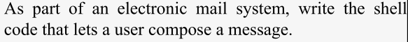

# 📚 Chapter 8: Process Handling

🔹 Introduction
- UNIX has user-controlled multitasking capability that is give each user control over more than one process.

- This chapter- bash features of multitasking and process handling.

## 🧠 Process IDs and Job Numbers

- **Process ID (PID)**: A unique number assigned by the operating system to every running process.

- **Background Job**: A process that runs without blocking the terminal, started by appending & at the end of a command.

- **Job Number**: A number assigned by the shell to keep track of background jobs executed from your current terminal.

```bash
ls &
# [n] = job number
# xxxxx= process id
```
- Adding multiple background jobs:
```bash
sleep 100 &
sleep 50 &
sleep 20 &  
```
- When job completed:
```bash
[1]+  Done       sleep 100
``` 

- If exits with non-zero status
```bash
false &

[1]+  Exit 1                  false
```

## 🧩 Job Control
- Job can be controlled by sending it at background or bringing back to foreground or sending a signal. 

- PIDs are important for job controlling.

### Foreground and Background
- `fg` command: brings background job to foreground.

```bash
#if only one command running at background/ recent one if many
fg

#using job name
fg %job

#using job number
fg %job_number

#using PID
fg PID
```
- To list all jobs
```bash
jobs
```
🖥️ Options for `jobs`

| Option | Meaning                                         |
| ------ | ----------------------------------------------- |
| `-l`   | List all PIDs with jobs.                        |
| `-p`   | List only PIDs.                                 |
| `-n`   | Only jobs with status changes since last `jobs`.|
| `-r`   | Running jobs.                                   |
| `-s`   | Stopped jobs.                                   |
| `-x`   | Replaces %job with PID and execute the command. |

📌 Ways to Refer to Jobs

| Reference   | Meaning                               |
| ----------- | ------------------------------------- |
| `%N`        | Job number N                          |
| `%string`   | Job whose command starts with `string`|
| `%?mad`     | Job whose command contain `string`    |
| `%+` / `%%` | Most recent background job            |
| `%-`        | Second most recent job                |

### 🔸 Suspending Jobs

- To send a foreground job to background, suspend the job with `CTRL-Z`.
- It will stop and then can be resumed again.
```bash
# when press ^Z
[1]+  Stopped                 #command
```
To resume
```bash
#in foreground
fg

#in background
bg
```
- Use *%job* name or number if several jobs.

- Suspend using `CTRL-Y`, process stopped when tries to read input from terminal.    

## 🚨 Signals

- A message sent to a process telling it to do something.
Eg. CTRL-Z to stop a process.
- It allow processes to communicate: Interprocess Communication (IPC).

- Signals can be used for multiple purposes.
- It have numbers and names. The list can be seen by:
```bash
kill -l
```
- Signal names are more portable than numbers.

### 🎛️ Control-Key Signals 

| Control Key | Signal Name | Meaning                     |
| ----------- | ----------- | --------------------------- |
| `CTRL-C`    | `SIGINT`    | Interrupt the process       |
| `CTRL-Z`    | `SIGTSTP`   | Suspend (pause) the process |
| `CTRL-\`    | `SIGQUIT`   | Quit the process (stronger) |

- This can be done during a foreground running proces.

- `KILL`: panic signal, used when `CTRL-\` does not work.       
Cannot be used in running process.

🔧 **Changing Signal Keys with stty**
- Options of `stty` can help to customize the CTRL keys for signal.

- Usual Syntax
```bash
stty signame char
```
### 🔪 kill 
- `kill` command sends signal to any process with the PID, job number or name. 

📌 Syntax:
```bash
kill [options] PID
kill -SIGNAL PID
kill %job_number
```
🔹 By Default: send `SIGTERM` (terminate),  similar to `SIGINT`.

- To kill a process, follow this order:
Suppose run the command
```bash
sleep 100 &
#job number=1
```

**1.** `TERM`: use this first.
```bash
kill %1
```
- Output: 
```bash
[1]+ Terminated sleep 100
```

**2.** Use `QUIT` if `TERM` does not work
```bash
kill -QUIT %1
```
- Output: 
```bash
[1]+ Exit 131 sleep 100
```

**3.** Use `KILL` as the last option to end the process.
```bash
kill -KILL %1
```
- Output:
```bash
[1]+ Killed sleep 100
```

If `KILL` does not end the process then it is in one of the funny states.

<br>

> TASK-1            

- Create *killalljobs* script
- Add this code in script.
```bash
kill "$@" $(jobs -p)
```
- `QUIT` and `TERM` allow processes to clean up before exiting while `KILL` will end up immediately anywhere in processing.

`kill` command can be used to terminate other processes as well apart from bg jobs.
- If terminate a process of one shell from other shell, use PID.
```bash
kill < PID >
```
### 📊 ps - Process Status

`ps` command give information about the processes.
```bash
# to list all processes in current shell
ps

# to list processes from all terminals
ps -a   
```
- Options of `ps` varies depending on version of UNIX system.
Two major types of UNIX systems are: **System V** and **BSD**.

#### 🧪 System V

- Ouput of `ps` command is
```bash
    PID TTY          TIME CMD
  20798 pts/0    00:00:00 bash
  24500 pts/0    00:00:00 sleep
  24556 pts/0    00:00:00 ps
```
- `ps -a` lists all jobs in all terminals except the parent shells.

- If two terminals and each running different processes. 
```bash
# in terminal-1
sleep 100

# in terminal-2
sleep 50 &
```

- Output of `ps -a`

```bash
    PID TTY          TIME CMD
   2736 tty2     00:00:00 gnome-session-b
  24745 pts/1    00:00:00 sleep
  24877 pts/0    00:00:00 sleep
  24971 pts/0    00:00:00 ps
```

- Can use PID to `kill` process of any terminal.

#### 📌 BSD

- Output of `ps` command:
```bash
 PID TT STAT TIME COMMAND 
 146 10 S    0:03 /bin/bash
2349 10 R    0:03 killalljobs
2367 10 D    0:17 sleep 50 
2389 10 R    0:09 sleep 10
2390 10 R    0:00 ps
```
- `ps -a` lists all jobs in all terminals also the parent shells.

- Some processes are dead or detached from terminal and forget from what and where they started, called **Zombies** or **Orphans**.

- These will not be shown in `ps -a` command list.

- To see these processes
```bash
# On System V
ps -e

# On BSD
ps -ax
```
- It can include basic processes running the system called **daemons** that handle services.

- The `?` are not showing terminal that is they do not have it or they are runaways.

## 🔐 trap
- A buit-in command that lets shell script to react properly in abnormal events.

🧠 Syntax:
```bash
trap 'command' sig1 sig2 ...
```
- *command* can be script or function.
- *sigs* can be specified by number or name. 

🎯 **Example**    
Created a script file called *loop*.
```bash
while true; do
  sleep 5
done
```
- Press `^C` (INT key) and it will stop.

- Now, add this at the start of script.
```bash
trap "echo 'You hit CTRL-C!'" INT
```
- Pressing `^C` will show the message given and continue the loop. 
- Hit `^Z` to stop and kill with `kill  %1`.

- Run the script in background
```bash
chmod +x loop
./loop &
```
- Then kill it with `kill %/.loop` and the script will terminate.

`TERM` can be added in script with `INT`.
```bash
trap "echo 'You hit control-C!'" INT TERM
```
- Now, run the script and type `kill %1`, which will not terminate and show the message and continue the process.

- Type this to end the process.
```bash
kill -KILL %1
```
- Or write different messages and try both signals.

```bash
trap "echo 'You hit CTRL-C!'" INT
trap "echo 'You tried to kill me!'" TERM

while true; do
  sleep 60
done
```
### 🔄 Traps and Functions

- Functions are considered part of shell and thus `trap`s in shell will be recognized inside function.
- `Trap`s inside function will be recognized by invoking shell when function is called.

Create *settrap* script
```bash
settrap() {
  trap "echo 'You hit CTRL-C!'" INT
}
settrap

while true;do
  sleep 60; 
done
```
- The `trap` will exist outside the funtion as well when script is executed.  

📦 Redefining the `trap`

```bash
loop() {
  trap "echo 'How dare you!'" INT
  while true; do 
    sleep 60; 
  done
}
trap "echo 'You hit CTRL-C!'" INT
loop


# OR
loop() {
  trap "echo 'How dare you!'" INT
} 

trap "echo 'You hit CTRL-C!'" INT
loop

while true; do 
  sleep 60; 
done
```
- The `trap` inside function is redefining the `trap` outside function.

<br>

> TASK-2    


- Create message in temporary file through `cat`.
```bash
msgfile=/tmp/msg$$
cat > $msgfile
```
- Type the message and end it with `^D`.

### 📂 Process ID Variables and Temporary Files

- The `$$` in the above script is Process ID of the script.
```bash
# check the PID with ps
ps

# now see the $$ value
echo $$
```
- If subshell is created with `bash`, it will have different PID (mostly higer value).

- To see process ID of most recent bg job
```bash
# start a job
sleep 5 &

#check the PID
echo $!
```
- In above example, the `$$` will create ID file.
- *tmp* will create temporary file.

- The script removes the file to avoid space takeup.
```bash
# Add this line at end of the script.
rm $msgfile
```
- If execution is terminated with `^C` in between, save the message in file called *dead.letter* and exit with `trap` command.
```bash
trap 'mv $msgfile dead.letter; exit' INT TERM

msgfile="/tmp/msg$$"
cat > "$msgfile"

# Send the mail message to the specified mail.

rm "$msgfile"
```
- If termination is before msgfile creation, will create error. Thus,
```bash
cleanup() {
  if [ -e "$msgfile" ]; then
    mv "$msgfile" dead.letter
  fi
  exit
}

trap cleanup INT TERM

msgfile="/tmp/msg$$"
cat > "$msgfile"

# Send the mail message to the specified mail.

rm "$msgfile"
```

### 🚫 Ignoring Signals

If require a script to ignore a signal, pass an empty command `""` to `trap`.

- `HUP`- hangup signal will kill the process receiving it.
- To ignore this signal and keep the process continued, use `trap`
```bash
ignorehup() {
  trap "" HUP
  eval "$@"
}
```
- Alternatively, use *`nohup`* command. It prevents `HUP` from terminating the command.

- Example of task 7-2.
```bash
eval nohup "$@" > logfile 2>&1 &

## or better

nohup "$@" > logfile 2>&1 &
```
- If no redirection for output specified, it will be saved in *nohup.out* file.

### 🔷 disown
- Another way to ignore `HUP` signal.
- `disown` with job number or PID, will remove the job from the job list. Thus no effect of `HUP`.

```bash
disown [job_number]/PID
```

🧰 Options:  
| Option | Use                                         |
| ------ | ------------------------------------------- |
| `-a`   | Apply to **all jobs**                       |
| `-r`   | Apply only to **currently running** jobs    |
| `-h`   | Prevent `HUP` signal from affecting the job |

🛠️ Resetting Traps

- Using `-` with `trap` will lead to default settings after the signal is received and process is terminated (most probably).

```bash
trap - sig1 sig2 ...
```
- In task-2, `trap` can be reset
```bash
trap cleanup TERM
trap abortmsg INT

msgfile="/tmp/msg$$"
cat > "$msgfile"

# ...send message...

rm "$msgfile"

trap - INT TERM  # Reset trap 
```
- After `trap -`, any new `INT` or `TERM` signal will terminate the script as usual.

## 🌀 Coroutines

- These are two or more processes explicitly run at the same time within a script.

- Pipelines like `ls | more` are coroutines with communication.
```bash
ls | more
```
UNIX (via the shell) starts the system calls and performs the following steps:
| Step | Operation                        | System Call Used |
| ---- | -------------------------------- | ---------------- |
| 1    | Create two processes (P1, P2)    | `fork`           |
| 2    | Connect P1's stdout → P2's stdin | `pipe`           |
| 3    | Run `ls` in P1                   | `exec`           |
| 4    | Run `more` in P2                 | `exec`           |
| 5    | Wait for both to finish          | `wait`           |

🧪 Coroutines Without Communication
- If run two process individually without communication.
```bash
sleep 50 &
sleep 10
```
- If in this script the background job keeps running and the last command ends, the bg job will become orphan.

### ⏳ wait

- To avoid finishing of script before the commands inside, use `wait` command at the end of the script.

```bash
wait
```
- Without arguments, waits for all the background jobs to complete.
```bash
sleep 50 &
sleep 10 
wait
```

- For specific jobs to wait for, give PID of job
```bash
wait <pid>   # Wait for a specific background process
```

### ⚙️ Advantages & Disadvantages of Coroutines

- Even if processes don’t interact (i.e., no pipelines) and running with one processor (CPU), coroutines can still be useful,especially for performance.

🔍 Processes differ in resource usage:
- **CPU-intensive** → heavy computations
- **I/O-intensive** → read/write operations
- **Interactive** → wait for user input

If jobs differ in resource usage, running them in parallel may improve performance.

But, if two jobs use same resource, the performance can decrease as both are depended on same resource.
- The resource need to switch the jobs, also cause *thrashing*, and system can hang.


### 🚀 Parallelization

- If multiple CPUs, chances of thrashing decreases and the speed increases in parallel computers.
- If processes run on differnt coroutines it is called *parallelizing* the job.

📊 Running time of coroutines:
- In multiple CPUs:
Time of longest running job + overhead

- Otherwise:
Sum of runtimes of all processes.

- If all jobs have same time:
Speedup factor = number of CPUs.

<br>

> TASK-3    

- Create script *mcp*.  
⚡ **Goal**: Copy the *filename* to multiple destinations simultaneously.
```bash
#command
mcp filename dest1 dest2 ...
```
--> Solution:
```bash
file=$1
shift 
for dest in "$@"; do
  cp $file $dest
done
```
- To parallize this script, send job to bg and add wait.
```bash
file=$1
shift 
for dest in "$@"; do
  cp $file $dest &
done
wait
```
- Same destination twice may lead to corrupted files, add code to detect duplicates.

- The system has concurrent access to the file, which can cause *concurrent control* issues. Thus require more code to handle this.

## 💠 Subshells

A subshell is a separate instance of the shell started by the script or shell session.

### 🛡️ Subshell Inheritance

✅ A subshell inherits:
- The current directory
- Environment Variables
- Open file descriptors (stdin, stdout,stderr,etc.)
- Ignored Signals 

❎ A subshell does NOT inherit:
- Shell variables except environment variables in environment file.
- Handling signals not ignored.

### 🧱 Nested Subshells

- Start subshell script in the parent script by using parenthesis `()`.

- The previous chapter example
```bash
( while read line; do
    echo "$(alg2rpn $line)"
  done
) | dc
```

🔄 Subshell vs. Command Block 

| Feature                | `{ }` Command Block | `( )` Subshell           |
| ---------------------- | ------------------- | ------------------------ |
| Executes in same shell | ✅ Yes               | ❌ No (runs in subshell)  |
| Variable persistence   | ✅ Variables persist | ❌ Variables lost outside |
| Trap persistence       | ✅ Persists          | ❌ Traps discarded        |
| Efficiency             | ✅ Faster            | ❌ Slightly slower        |
| Scope isolation        | ❌ None              | ✅ Full isolation         |

- In command block:
```bash
{
  hello=hi
  trap "echo 'You hit CTRL-C!'" INT
}
while true; do
  echo "$hello"
  sleep 5
done
```

- In Subshell
```bash
(
  hello=hi
  trap "echo 'You hit CTRL-C!'" INT
)
while true; do
  echo "\$hello is $hello"
  sleep 5
done
```
- If variable definitions or signal traps is there is script, use subshells for isolation.

## 🔄 Process Substitution

Allows to use the output or input of a command as a file.

🧾 Syntax
| Direction | Syntax       | Description                              |
| --------- | ------------ | ---------------------------------------- |
| Output    | `<(list)` | Used as output from a process |
| Input     | `>(list)` | Used as input to a process   |

- `list` is the process having connected to something via *named pipe* that is temporary file acting like pipe.

- Example: If two programs with large output and compare the difference in them.
- Using `cmp` utility that checks the difference in files.

- One way:
```bash
prog1 > file1
prog2 > file2
cmp file1 file2
```
- Using Process Substitution
```bash
cmp <(prog1) <(prog2)
```
- The programs run concurrently and outputs are connected to the pipes. 